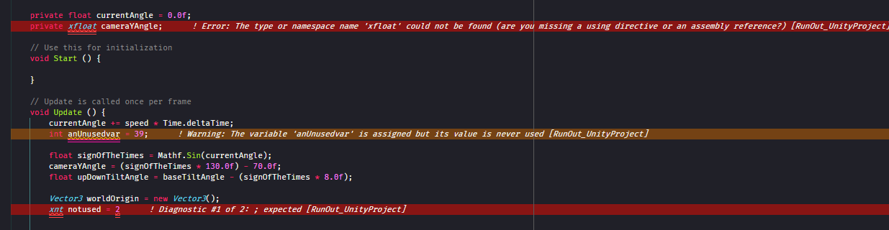

# ErrorLens README

Welcome to ErrorLens.

ErrorLens enhances Visual Studio Code's inbuilt diagnostic highlighting. Visual Studio Code's default behavior for is to underline errors/warnings/info using a 'squiggly underline'. Whilst this is useful, it is sometimes possible to overlook errors and warnings.

ErrorLens turbo-charges the language diagnostic features, by making diagnostics stand out more prominently, highlighting the entire line wherever a diagnostic is generated by the language and also prints the diagnostic message(s) in-line at the site of the line of code which is generating the diagnostic.

## Features

* Lines containing errors or warnings or info are highlighted more obviously.
* Diagnostic descriptions are appended to the end of any line containing diagnostic info, meaning that you do not have to context-switch to the problem view.
* The status bar shows the number of diagnostics for the open file.
* Settings can be configured to control the way ErrorLens displays enhanced diagnostics.
* Works for any language which provides diagnostics.

## Requirements

Built using Visual Studio Code 1.27.

Tested on Windows 10 (64-bit), Linux Mint & OSX 10.13.

## Extension Settings

This extension contributes the following settings:

* `errorLens.errorColor`: The background color used to highlight lines containing errors. (Alpha component can be used)
* `errorLens.warningColor`: The background color used to highlight lines containing warnings. (Alpha component can be used)
* `errorLens.infoColor`: The background color used to highlight lines containing info. (Alpha component can be used)
* `errorLens.hintColor`: The background color used to highlight lines containing hints. (Alpha component can be used)
* `errorLens.fontStyle`: Show ErrorLens annotations in Italics, or not?
* `errorLens.fontWeight`: Show ErrorLens annotations in Bold or not?
* `errorLens.fontMargin`: Distance between end of the code line, and the start of the ErrorLens annotation. (CSS units)
* `errorLens.errorMsgPrefix`: A customizable prefix string, which is added at the start of the ErrorLens annotation.

## Contributing & contacting the author

The project is hosted on Github at: https://github.com/phindle/error-lens. Please submit suggestions, bug reports, Pull Requests and so on here.

I'm occasionally on Twitter @GeekyMcGeekface

## Known Issues

None known.

## Release Notes

### 1.0.0

Initial release of ErrorLens (October 2018)
